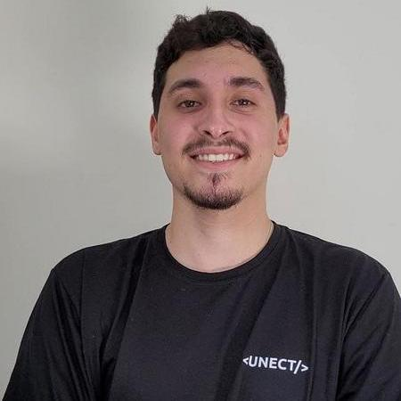

# Apresentação

Olá! Meu nome é **Thomas Hurtado dos Reis** 👋

Sou estudante na **Universidade Tecnologica Federal do Paraná**, cursando **Engenharia da Computação**. Tenho interesse e dedicação na área de tecnologia, buscando sempre aprender e crescer profissionalmente.

## Experiências na área de tecnologia 💻

- [ ] Já participei de uma empresa júnior chamada Unect Jr, nela era responsavel pelo desenvolvimento back-end  
- [ ] Tenho experiência com linguagens como Python, JavaScript, Java e C++
- [ ] Na Unect atuava com equipes, utilizando metodologias ágeis como Scrum  

## Hobbies e Interesses 🌱

- Gosto de aprender sobre novas tecnologias do mercado
- Tenho interesse por Inteligência Artificial, especialmente na área de machine learning
- No tempo livre, curto jogar jogos online e assitir jogos de futebol

## Outras informações 📝

- Busco constantemente evoluir como profissional e contribuir de forma positiva 
- Tenho facilidade para trabalhar em grupo e boa comunicação
- Tenho uma boa adaptabilidade a novas áreas

