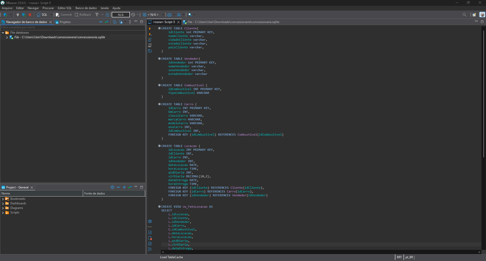
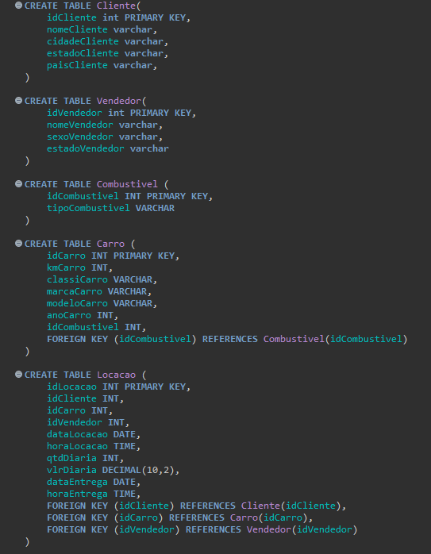
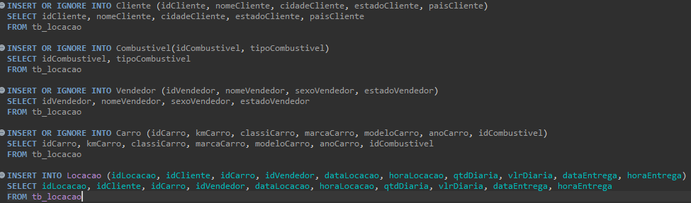
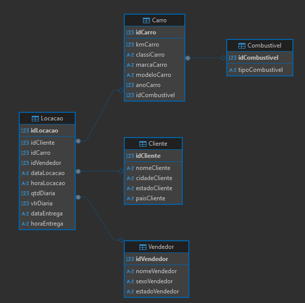
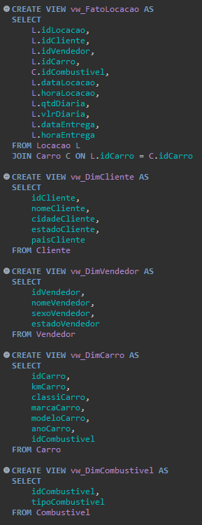
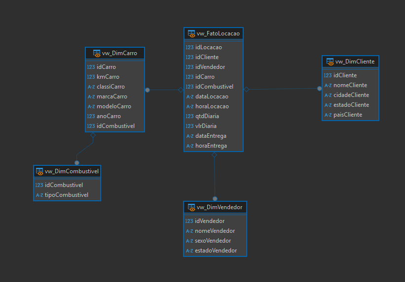

# Desafio da Sprint

O desafio da Sprint consiste em realizar a normalização de uma base de dados, sendo necessario aplicar as formas normais para transforma-lá em 
um modelo relacional e posteriormente em um modelo dimensional.

A realização deste desafio estará divido em 2 etapas

## Etapa 1

O objetivo desta etapa é tranformar a base de dados em um modelo relacional, aplicando as formas normais.
Para isso foi seguido as seguintes etapas:

- Utilização do Dbeaver para modifcar a base de dados

- Aplicar a Primera Forma Normal (1FN), porém a base de dados ja esta nessa forma, não há campos multivalorados
- Aplicar a Segunda Forma Normal (2FN), com isso separei em objetos diferentes, criando tabelas distintas. Foram criadas as tabelas Carro, Locação, Combustivel, Cliente e Vendedor

- Aplicar a Terceira Forma Normal (3FN), porém as tabelas ja estão nesse formato
- Inserir os dados em suas respectivas tabelas

- Construir a visualizacao do modelo Relacional

## Etapa 2

O objetivo desta etapa´é contruir o modelo dimensional baseado no modelo ralacional.
Para isso foi seguido as seguintes etapas:

- Identificar a tabela fato, o centro do modelo dimensional, sendo ela a tabela locação
- Identificar as dimensões, tabelas que descrevem o fato, sendo elas Carro, Combustivel, Cliente e Vendededor
- Criação das telas "Views"

- Contruir a visualização do modelo dimensional
- Dififinir o modelo dimensional, neste caso o snowflake, pois combustivel se relaciona com a tabela carro

## Finalização

Por fim, os objetivos foram alcançados, a tabela inicial foi transformada em modelos relacional e dimensional conforme o desafio estava pedindo.