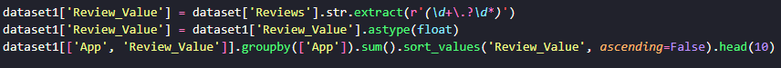

# Desafio da Sprint

O desafio da Sprint consiste em processar e gerar gráficos a partir de um dataset fornecido.
A realização do desafio esta separado em 8 exercicios

## Importando bibliotecas

Para iniciar o desafio, o primeiro passo é importar as bibliotecas Pandas e Matplotlib.
Após isso, é necessario declarar o dataset

## Exercicio 1

O item pedia para realizar a remoção de itens duplicados, aqui esta o passo a passo:

- Usar a função abaixo para remover as linhas duplicas e declarar um novo database

## Exercicio 2

O item pedia para construir um grafico com os apps com mais instalações, aqui esta o passo a passo:

- Realizar uma copia do datasset para nao mudar o original
- Criar uma nova coluna com o numero de instalcoes por aplicativo
- Substituir o caracter virgula e retirar todos os caracteres que nao são numeros, a partir do uso de regex
- Transformar as strings em float
- Realizar o filtro adequado, utilizando funções, para retornar o que o exercicio pedia
- o Filtro consistem em agrupar o dataset pelo nome de cada aplicativo e posteriormente fazer a soma das intalações

- Aqui esta o retorno do filtro utilizado

## Exercicio 3

O item pedia para construir um grafico de pizza com as categorias dos aplicativos juntamento com sua frequencia

- Realizar o filtro adequado, utilizando funções, para retornar o que o exercicio pedia
- O filtro consiste em asgrupar o dataset por casa categoria e posteiromente somar as linhas
- A partir do filtro construir um grafico de pizza, com a sua frequencia

- Aqui esta o grafico

## Exercicio 4

O item pedia para mostrar qual o app mais cara do dataset,

- Construir uma nova tabela com os preços dos aplicativos
- Extrair os caracteres que não são numeros
- Transformar as strings em float
- Realizar o filtro adequado, utilizando funções, para retornar o que o exercicio pedia
- O filtro consiste em ordenar a coluna pelo preço do aplicativo

- Aqui esta o retorno do filtro utilizado

## Exercicio 5

o item pedia para mostrar quantos aplicativos possuem uma certa categoria

- Realizar o filtro adequado, utilizando funções, para retornar o que o exercicio pedia
- O filtro consiste em agrupar os aplicativos que possuem a categoria pedida e posteriormente fazer a contagem

- Aqui esta o retorno do filtro

## Exercicio 6

O item pedia para mostrar os aplicativos com maior numero de "review"

- Construir uma nova tabela com o numero de review por aplicativo
- Extrair os caracteres que não são numeros
- Transformar as strings em float
- Realizar o filtro adequado, utilizando funções, para retornar o que o exercicio pedia
- O filtro consiste em agrupar os aplicativos pelo nome e posteriormente somar o numero de "review"

- Aqui esta o retorno do filtro

## Exercicio 7.1

O item pedia para realizar 1 calculo sobre o dataset e apresentar um em fomarto de lista

- Calcular as categorias com mais numeros de "review"
- Realizar o filtro adequado, utilizando funções, para retornar o que o exercicio pedia
- O filtro consiste em agrupar o dataset pela categoria e posteriormente somar o numero de "review"

- Aqui esta o retorno do filtro

## Exercicio 7.2

O item pedia para realizar 1 calculo sobre o dataset e apresentar um em fomarto de valor

- Calcular as categorias com mais numeros de instalações 
- Realizar o filtro adequado, utilizando funções, para retornar o que o exercicio pedia
- O filtro consiste em agrupar o dataset pela categoria e posteriormente somar o numero de instalaçoes

- Aqui esta o retorno do filtro

## Exercicio 8.1

O item pedia para construir um grafico a partir dos exemplos anteriores

- Aqui esta o retorno dos graficos

