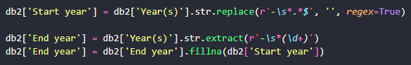

# Desafio da Sprint

O desafio da sprint é usar os conhecimentos adquirados ao longo do PB, uninando ao tema da Sprint, o Docker.
Para isso, é necessario realizar uma limpesa de dados no arquivo fornecido e posteriormente aplicar filtros para responder as questões.

## Distribuição das atividades

Para a realização do desafio, decidi por separar em 3 etapas:

- Etapa 1: Script para a limpeza de dados e o arquivo Dockerfile

- Etapa2: Script para responder as questões e o arquivo Dockerfile

- Etapa 3: Arquivo Docker-compose

## Etapa 1

Para a realização da Etapa 1 foi utilizado os seguintes métodos:

- A biblioteca Pandas para manipular o arquivo csv

- Remoção de colunas desnecessárias com a função .drop()

- Transformar os dados das colunas 'Actual gross', 'Adjustedgross (in 2022 dollars)' e 'Average gross' em numeros
    - Removers as vírgulas dos dados com a função .replace()
    - Extrair os dados que vem apos o '$' com a função .extract() utilizando REGEX

- Transformar a colunas 'Year(s)' em 2 colunas separadas, 'Start year' e 'End year'
    - Para coluna 'Start year' é necessario usar a coluna 'Year(s)' utilizando a função .replace() para substituir tudo que vem depois do hífen por vazio
    - Para coluna 'End year' é necessário usar a coluna 'Year(s)' utilizando a função .extract() para extrair tudo que vem depois do hífen
    - Após isso é necessário preencher os dados que ficaram vazios na coluna 'End year' utilizando a função .fillna() para que sejam iguais as dados da coluna 'Start year'

- Depois da limpeza de dados, é necessário exportar para um novo arquivo csv

- Construir o arquivo Dockerfile

## Etapa 2

Para a realização da Etapa 1 foi utilizado os seguintes métodos:

- A bibliotecas Pandas, para manipular o arquivo csv, e Matplotlib para construir gráficos

- Importar o novo database

- Exercicio 1 é necessário aplicar um script reponsavel por 
    - Agrupar o database pela coluna 'Artist' com a função .grupby()
    - Utilizar a função .agg() para criar colunas provisorias para somar a quantidade de aparições e ainda o 'Actual gross'
    - Abrir o arquivo .txt para inserir os resultados

- Exercicio 2 é necessário aplicar um script reponsavel por 
    - Localizar no database os dados que possuem 'Start year' igual a 'End year' com loc[]
    - Filtrar o dado que possue o maior 'Average gross' com .max()
    - Abrir o arquivo .txt para inserir os resultados

- Exercicio 3 é necessário aplicar um script reponsavel por 
    - Contruir uma nova coluna chamada 'Actual AVG', dividindo os valores das colunas 'Adjustedgross (in 2022 dollars)' e 'Shows'
    - Ordenar os valores dessa nova coluna para retornar os 3 maiores 
    - Abrir o arquivo .txt para inserir os resultados

- Exercicio 4 é necessário aplicar um script reponsavel por
    - Utilizar o filtro desenvolvido no exercicio 1
    - Capturar o nome do artista
    - realizar um filtro para retornar as colunas 'Actual gross' e 'Start year' que possuem o nome deste artista com o .loc[]
    - Contruir um grafico de linhas com os dados do filtro
    - Salvar a imagem do gráfico

- Exercicio 4 é necessário aplicar um script reponsavel por
    - Agrupar o database pela coluna 'Artist' com a função .grupby()
    - Utilizar a função .agg() para criar colunas provisorias para somar a quantidade de Shows de cada artista
    - Ordenar os valores pela quantidade de shows e retornar os 5 maiores valores
    - Contruir um grafico de colunas com os dados do filtro
    - Salvar a imagem do gráfico

- Construir o arquivo Dockerfile

## Etapa 3

- Contruir o arquivo Docker-compose.yaml

- Executar o arquivo Docker compose

- Respostas da execução:

