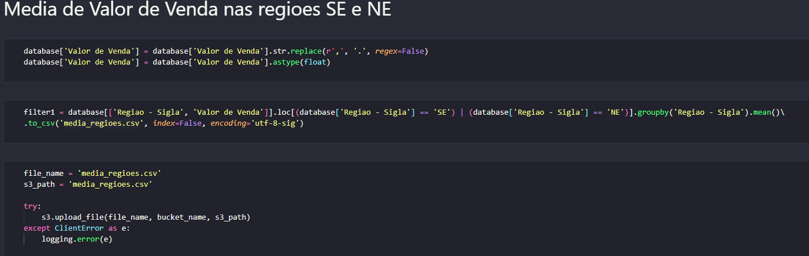

# Desafio da Sprint

O desafio da sprint é praticar a utilização dos serviços AWS. 
Para desenvolver o desafio era necessario utilizar o conhecimentos de python, pandas e AWS.
Dessa forma, o objetivo era escolher uma base de dados, envia-lá para um s3 Bucket, após isso usar essa base 
de dados remotamente para fazer a realização de algumas filtragens

## Distribuição das atividades

Para a realização do desafio, decidi por separar em 3 etapas:

- Preparação: Separar uma base de dados

- Etapa 1: Script para carregar a base de dados para um novo S3 Bucket

- Etapa 2: Script para ler a base de dados remota e realizar filtros necessarios

## Preparação

- Escolher uma base de dados do site do governo

## Etapa 1

Para a realização da Etapa 1 foi utilizado os seguintes métodos:

- Importar as bibliotecas necessárias (boto3, ClientError, logging, os e load_dotenv)

- Criar um arquivo ".env" para mascarar as credencias de login para AWS

- Carregar as plavras-chave do arquivo .env

- Declarar o s3 utilizando o boto3
    - Utilizar a função .client, junto das credenciais para se conectar a AWS

- S3 Bucket:
    - Declarar o nome do bucket a ser utilizado
    - Declarar o arquivo que será enviado
    - Declarar o nome do arquivo que constará no bucket

- Enviar o arquivo para a AWS
    - Utilizar a função .upload_file() para enviar 
    - Utilizar as bibliotecas logging e ClientError para evitar erros, como consta na documentação do boto3

## Etapa 2

Para a realização da Etapa 2 foi utilizado os seguintes métodos:

- Importar as bibliotecas necessárias (boto3, ClientError, logging, os, pandas e load_dotenv)

- Carregar as plavras-chave do arquivo .env

- Declarar o s3 utilizando o boto3
    - Utilizar a função .client, junto das credenciais para se conectar a AWS

- S3 Bucket:
    - Declarar o nome do bucket a ser utilizado
    - Declarar o arquivo que será recebido
    - Utilizar a função .get_object() para receber os dados da base de dados
    - Declarar o database

- Realizar uma limpeza dos dados que nao serão utilizados com a função .drop()

- Primerira filtragem: Media de Valor de Venda nas regioes SE e NE
    - Substituir o caracter " , " por " . " da coluna "Valor de Venda" utilizando a função .replace()
    - Transformar os dados da coluna "Valor de Venda" em float
    - Filtragem:
        - Utilizar a função .loc[] para localizar os dados com a coluna "Região - Sigla" igual a "SE" e "NE"
        - Utilizar a função .groupby() para agrupar por regiao
        - Utilizar a função .mean() para receber a media dos valores
        - Utilizar a função .to_csv() para converter o resultado em um arquivo csv
    - Upload para o Bucket:
        - Utilizar a função .upload_file() para enviar o arquivo resultante
        - Utilizar as bibliotecas logging e ClientError para evitar erros, como consta na documentação do boto3

- Segunda filtragem: Quantidade de vezes que foi registrado 'Gasolina' em cada estado
    - Filtragem:
        - Utilizar a função .loc[] para localizar os dados com a coluna "Produto" igual a "GASOLINA"
        - Utilizar a função .groupby() para agrupar por estado
        - Utilizar a função .count() para receber somar a quantidade de vezes que apareceu 
        - Utilizar a função .to_csv() para converter o resultado em um arquivo csv
    - Upload para o Bucket:
        - Utilizar a função .upload_file() para enviar o arquivo resultante
        - Utilizar as bibliotecas logging e ClientError para evitar erros, como consta na documentação do boto3

- Terceira filtragem: Os 10 maiores lucros por litro (Preço de compra - preço de venda)
    - Fazer uma copia do database utilizando a função .copy(), pois sera necessario criar mais colunas
    - Substituir o caracter " , " por " . " da coluna "Valor de Compra" utilizando a função .replace()
    - Transformar os dados da coluna "Valor de Compra" em float utilizando a função .astype()
    - Remover as linhas que nao possuem dados nas colunas "Valor de Compra" e "Valor de Venda" com .dropna() utilizando um subset
    - Criar uma nova coluna chamada "Lucro": (Preço de compra - preço de venda)
    - Filtragem:
        - Ordernar pela coluna "Lucro" utilizando a função .sort_values()
        - Mostrar as 10 primeiras linhas com .head()
        - Utilizar a função .to_csv() para converter o resultado em um arquivo csv
    - Upload para o Bucket:
        - Utilizar a função .upload_file() para enviar o arquivo resultante
        - Utilizar as bibliotecas logging e ClientError para evitar erros, como consta na documentação do boto3

- Arquivos na AWS:
