# Desafio da Sprint

O desafio da sprint é realizar as etapas inicias de um DataLake. 
Para desenvolver o desafio era necessario utilizar o conhecimentos de python, AWS e Docker.
Dessa forma, o objetivo era enviar 2 bases de dados para um S3 Bucket por um Script de python, após
isso, era necessario complementar com dados de APIs do IMDB. Esses dados teriam que ser enviados 
pelo AWS Lambda.

## Distribuição das atividades

Para a realização do desafio, decidi por separar em 3 etapas:

- Preparação: Definir os pontos a serem trabalhados

- Etapa 1: Script para carregar a base de dados para um novo S3 Bucket

- Etapa 2: Script na AWS Lambda para resgatar dados vindo de APis escolhidas

## Preparação

O objetivo do meu DataLake é comparar as 10 animações japonesas (animes) com maiores medias de avaliação.

Para isso será necessario analisar os quesitos em comum dessas animações como número de episódios, temporadas
produtoras, categorias, entre outras.

## Etapa 1

Para a realização da Etapa 1 foi utilizado os seguintes métodos:

- Importar as bibliotecas necessárias (boto3, ClientError e logging)

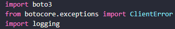

- Realizar um input para o usuario digitar as credenciais da AWS

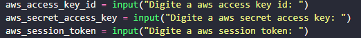

- Declarar o s3 utilizando o boto3
    - Utilizar a função .client, junto das credenciais para se conectar a AWS
    
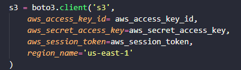

- S3 Bucket:
    - Declarar o nome do bucket a ser utilizado
    - Declarar o arquivo que será enviado
    - Declarar o nome do arquivo que constará no bucket

- Enviar o arquivo para a AWS
    - Utilizar a função .upload_file() para enviar 
    - Utilizar as bibliotecas logging e ClientError para evitar erros, como consta na documentação do boto3

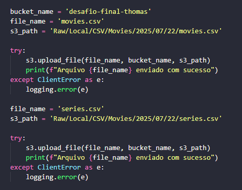

- Construir um arquivo Dockerfile
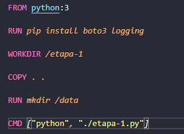

- Reposta Docker run
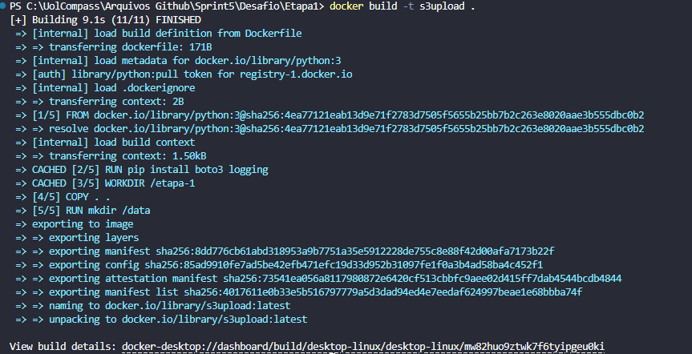

- Arquvios no S3
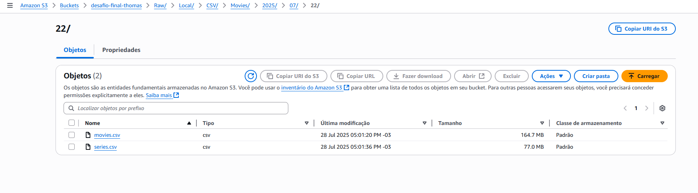

## Etapa 2

Para a realização da Etapa 2 foi utilizado os seguintes métodos:

- Importar as bibliotecas necessárias (boto3, requests, json, os e datetime)

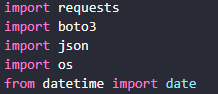

- Utilizar a variavel de ambiente do proprio Lamda para mascarar o API KEY

- Utilizar a biblioteca datetime para resgatar o data atual 
    - Utilizar a função .today()

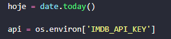

- Definar a URL da API juntamente dos parametros
    - URL da API do IMBD para retornar as series necessarias
    - Parametros:
        - Chave da api para conseguir resgatar os dados
        - 'PT-BR' para do texto estar em portugues
        - Ordenar pela media dos votos
        - Filtro para series de Animação
        - Filtro para series Japonesas
        - Definir um minimo de votos

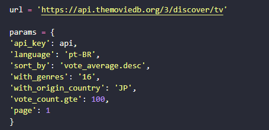

- Definir o retorno dos dados em json
    - Regatar o retorno dos dados utilizando requests.get(), usando os paramentros e a url
    - Definir esses retorno para json
    - Utilizar a função .dumps() para os dados ficarem organizados e facilitar a leitura

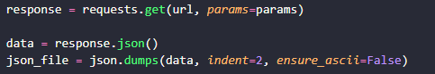

- Declarar o s3 utilizando o boto3
    - Utilizar a função .client para se conectar a AWS

- S3 Bucket:
    - Declarar o nome do bucket a ser utilizado
    - Declarar o arquivo que será enviado
    - Utilizar a função .put_object() para enviar os dados json

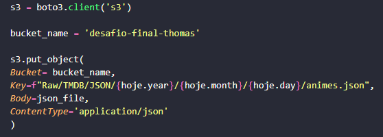

- Realizar 10 chamdas de API com os dados resgatados
    - Definir variaveis para checar a contagem e o limite
    - Utilizar um laço for para realizar diversas chamdas de API
    - Utilizar os IDs recebidos da primeira requisição para fazer novas requisições 
    - S3 Bucket:
        - Declarar o nome do bucket a ser utilizado
        - Declarar o arquivo que será enviado
        - Utilizar a função .put_object() para enviar os dados json

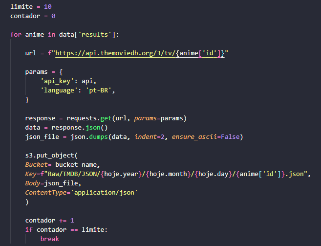

- Arquivos no s3:
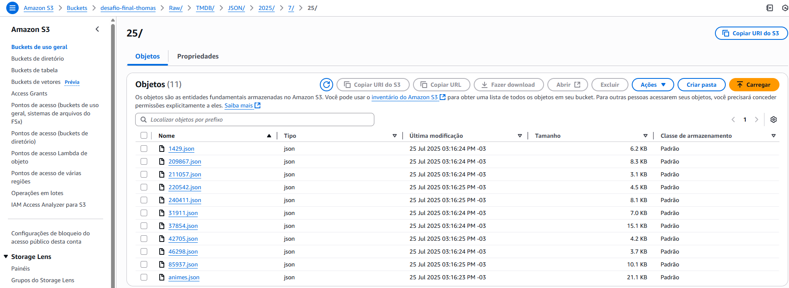
